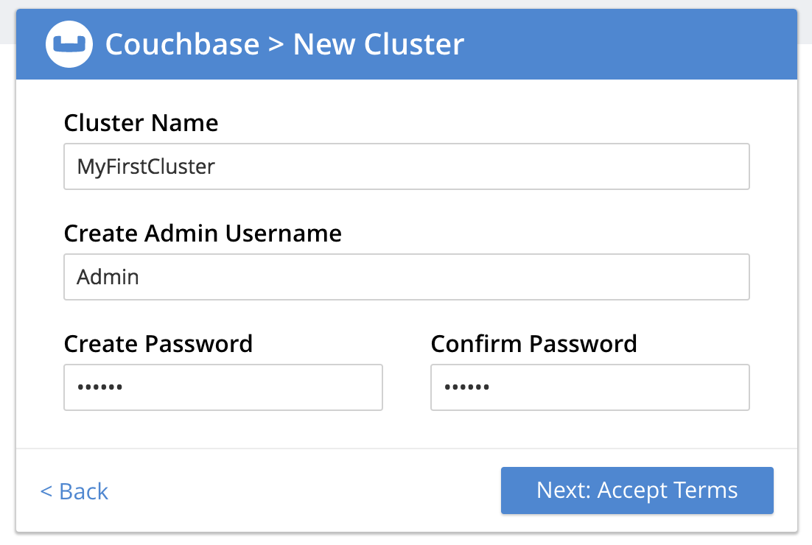
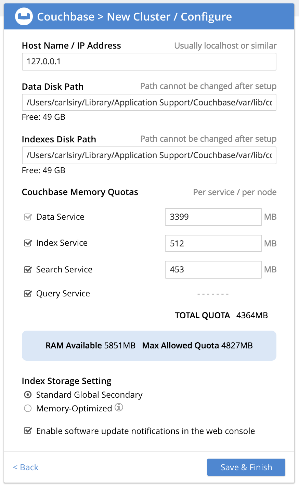

# 2017.12.12

## Check Out

## New

### couchbase-server-enterprise_5.0.0 安装配置

下载地址：
```
server: https://packages.couchbase.com/releases/5.0.0/couchbase-server-enterprise_5.0.0-macos_x86_64.zip

sync-gateway: https://packages.couchbase.com/releases/couchbase-sync-gateway/1.5.1/couchbase-sync-gateway-enterprise_1.5.1_x86_64.tar.gz
```
安装和配置：


相关配置文字记录：
```
Data Disk Path:
/Users/carlsiry/Library/Application Support/Couchbase/var/lib/couchbase/data

Indexes Disk Path:
/Users/carlsiry/Library/Application Support/Couchbase/var/lib/couchbase/data
```

安装couchbase的命令行工具 —— cbc : `brew install libcouchbase`
