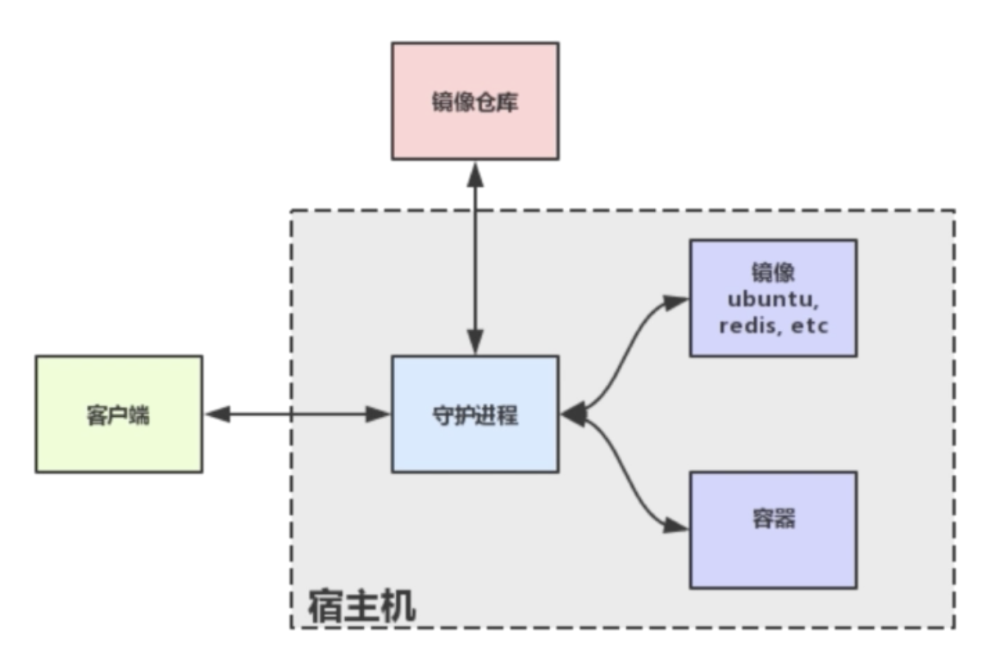

# 2018.01.18

## Check Out

## New

- 官方 docker 软件架构图



- 基础的客户端操作命令

```
# 查看本地的所有镜像
docker images
# 运行一个以8080:80端口映射的首台守护进程的nginx容器
docker run -p 8080:80 -d nginx
# 拷贝文件到容器中
docker cp xxx.html containerId://path/to/dirctory
# docker在容器内做的改动都是暂时的缺省的
# 需要提交docker commit -m "msg for commit" containerId imageName
# 删除镜像
# docker rmi imageId
# 删除容器
# docker rm containerId
```

- Dockerfile 文件构建镜像容器

```
# 首先创建一个简单的dockerfile文件
FROM alpine:latest
MAINTAINER xbf  
CMD echo 'hello docker'
# 运行构建镜像命令
docker build -t hello_docker .
```

```
# 指定一个基础镜像
FROM ubuntu
# 指定容器维护者
MAINTAINER Carlsiry
# 执行命令: 换取软件包的镜像源头为清华大学
RUN sed -i 's/archive.ubuntu.com/mirrors.ustc.edu.cn/g' /etc/apt/sources.list
RUN apt-get update
RUN apt-get install -y nginx
# 拷贝文件
COPY index.html /var/www/html
# 指定容器运行时的入口命令
ENTRYPOINT ["/usr/sbin/nginx", "-g", "daemon off;"]
# 制动容器的暴露端口
EXPOSE 80
```

- docker 镜像分层: 如果多个镜像有存在相同的层次，可以共享，减轻文件存储的压力
Dockerfile中的每一行都会产生一个新层

```
FROM alpine:latest 4eaefea3
MAINTAINER carlsiry 434dfdad
......
```

- docker 存储：提供独立于容器之外的持久化存储
